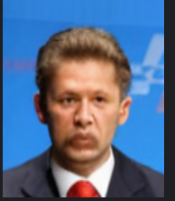
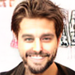
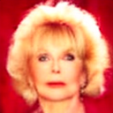

# Face Generator —— 基于 DiT 架构的人脸图片生成器

## 项目简介

**Face Generator** 是一个基于 **DiT（Diffusion Transformer）架构** 的人脸图片生成器，目标是实现：

* 类似 **Stable Diffusion** 的条件生成能力
* 通过多种显式条件（属性标签）控制人脸特征
* 支持更稳定的多属性组合与局部可控编辑

该项目源于作者在早期使用 **GAN** 生成人脸过程中的实际工程经验与不满，并最终选择使用 **DiT** 对任务进行重构。


**实现了通过标签输入来控制模型生成不同的人脸还有初步实现一些局部重绘功能。**

---

## 一、早期方案：基于 GAN 的人脸生成

在一些最原始的人脸生成项目中，通常采用 **GAN（Generative Adversarial Network）** 作为核心模型。

### 1. 条件 GAN 的基本思路

* 将人脸特征（性别、年龄、表情等）作为标签输入
* 在生成阶段注入条件，引导模型生成符合标签的人脸图像

### 2. 实际遇到的问题

在作者完成相关作业和实验过程中发现：

> **当条件标签数量增多时，条件 GAN 极易出现特征相互干扰，最终导致生成质量崩溃。**

具体表现为：

* **条件互相干扰**

  * 改“嘴巴” → 脸型一起发生变化
  * 改“年龄” → 性别特征开始漂移

* **部分条件被忽略**

  * Generator 学会：

    > “反正判别器也不太管这个标签”

* **Mode Collapse + Conditional Collapse**

  * 标签存在，但生成分布并未真正分离
  * 多个条件映射到相似或相同的生成结果

这些问题并非简单的调参或实现失误，而是 **GAN 对抗式训练目标与隐式 latent 表达的结构性缺陷** 所导致。

---

## 二、过渡方案：CNN-U-Net + Latent Diffusion

随着 Diffusion 模型的兴起，后续出现了：

> **CNN-U-Net + Latent Diffusion**

这一结构在一段时间内风靡生成领域，并成为 Stable Diffusion 等模型的核心基础。

### 1. 该方案的优势

* 使用 VAE 将图像映射到 latent 空间，降低计算成本
* 通过 U-Net 进行逐步去噪，训练稳定
* 相比 GAN，生成质量和多样性显著提升

### 2. 依然存在的问题

尽管性能相比 GAN 有明显进步，但在以下任务上仍然存在 **结构性缺陷**：

* 人脸生成
* 多条件解耦控制
* 局部可控编辑

其根本原因在于：

> **CNN 的归纳偏置（Inductive Bias）与“人脸生成 + 条件控制”这一任务并不匹配。**

#### 具体表现

* CNN 更擅长局部建模，不擅长整体结构理解
* 五官之间的全局关系（对称性、比例）只能在深层隐式学习
* 条件注入多为“外挂式”，容易被忽略或相互干扰

因此，CNN-U-Net 并不适合需要**整体结构建模与多属性精细控制**的生成任务。

---

## 三、最终方案：DiT（Diffusion Transformer）

### 1. DiT 的核心思想

**DiT（Diffusion Transformer）** 使用 **Transformer** 作为去噪网络，而不是传统的 CNN U-Net：

* 将图像切分为 Patch
* 将 Patch 视为 Token 序列
* 通过 Self-Attention 进行全局建模

> **这是第一次在扩散模型中，将“全局结构理解”作为核心能力，而非附加能力。**

### 2. DiT 的优势

* 原生支持全局关系建模（五官对称、脸型比例）
* 条件作为模型的核心输入，贯穿所有层
* 多属性天然可组合、可解耦
* 非常适合人脸、表情、属性等强结构目标

可以说，DiT 是：

> **真正“理解图像结构”的生成模型**

### 3. DIT的备受青睐

正因 DiT 在结构建模和条件控制上的优势，目前许多爆火的图像生成模型都采用了类似架构作为核心：

* GPT 系列的图片生成模型
* Qwen-Image
* Google 最新图像生成模型（如“nano banana”）

这标志着生成模型从：

> “局部逼真” → “整体一致 + 条件可控”

的范式转变。

---

## 五、说明

基于作者早期使用 GAN 生成人脸的实践经验，本项目选择：

* 放弃对抗式生成范式
* 使用 **DiT 重构人脸生成任务**

从而实现：

* 更稳定的人脸结构
* 更强的多条件解耦能力
* 更自然的局部编辑与属性控制

**Face Generator** 并非简单的模型替换，而是一次针对任务本质的架构升级。

## 具体解构
### 训练流程
``` 
输入图像 (128x128x3) 
       │
[ VAE Encoder ] (预训练好的)
       │
潜空间表示 z (16x16x4) ───┐
       │                 │
[ 加噪过程 ] <── 随机噪声 ε (16x16x4)
       │
带噪潜变量 z_t (16x16x4)      属性标签 y (12维)    时间步 t (1维)
       │                      │                  │
       └───────────┬──────────┴──────────────────┘
                   ▼
           [ Latent DiT 模型 ]  <── 核心学习部分
                   │
           预测速度向量 v_pred (16x16x4)
                   │
           [ Loss 计算: MSE + Laplacian ]
``` 

### LatentDiT 类定义的模型骨架
``` 
z_t (16, 16, 4)
      │
[ Patch Embed ] (Conv2d, stride=2, patch=2)
      │  转化后 shape: (64, 1024)  <-- 64个Token, 每个1024维
      ▼
[ + Positional Embedding ] (位置编码)
      │
      │       ┌─────────────────────────────────────────┐
      │       │        条件分支 (Conditioning)            │
      │       │  t ──> [Timesteps] ──> [MLP] ──┐        │
      │       │                                (+) ──> c│
      │       │  y ──> [Linear] ───> [SiLU] ───┘        │
      │       └──────────────────────────┬──────────────┘
      │                                  │
      ▼                                  │
[ DiT Block 1  ] <── (注入条件 c) ─────────┤
[ DiT Block 2  ] <── (注入条件 c) ─────────┤
      ...        <── (注入条件 c) ─────────┤ (重复15层)
[ DiT Block 15 ] <── (注入条件 c) ─────────┘
      │
      ▼
[ LayerNorm ] (基于 c 调制)
      │
[ Final Linear ] (映射回 2x2x4 = 16维)
      │
[ Unpatchify ] (重排像素)
      │
      ▼
预测的 v (16x16x4)
``` 
### DiTBlock 类的具体实现
``` 
输入 x (Token Sequence)
│
│
├─ LN (no affine)
│
├─ AdaLN(γ1, β1)   ←─ 条件注入
│
├─ Self-Attention
│
├─ × g1            ←─ 残差门控
│
├─ + x  ────────────────┐
│                       │
├─ LN (no affine)       │
│                       │
├─ AdaLN(γ2, β2)        │
│                       │
├─ MLP (1024 → 4096 → 1024)
│                       │
├─ × g2                 │
│                       │
└─ + ───────────────────┘
   ↓
输出 x'
``` 
## 初步实现的局部重绘原理说明：
本质是通过特征定位提取范围作为掩膜将相应的部分输入模型然后作为dit模型的输入进行进一步扩散推理，实现局部重绘
但是目前存在不够通用的问题，只能通过标签进行局部修改，同时因为分辨率的问题导致掩膜在潜空间太小比较模型导致效果一般
### 效果
#### 添加胡子后

 
#### 添加胡子前


## 运行使用
``` 
python train.py # 训练模型
python ts.py    #生成图片，可以通过输入的特征从而控制生成，并且进行超分辨率
``` 
### 效果（相比gan模型人脸对称度还有特征都更明显）
#### 男性


#### 女性



